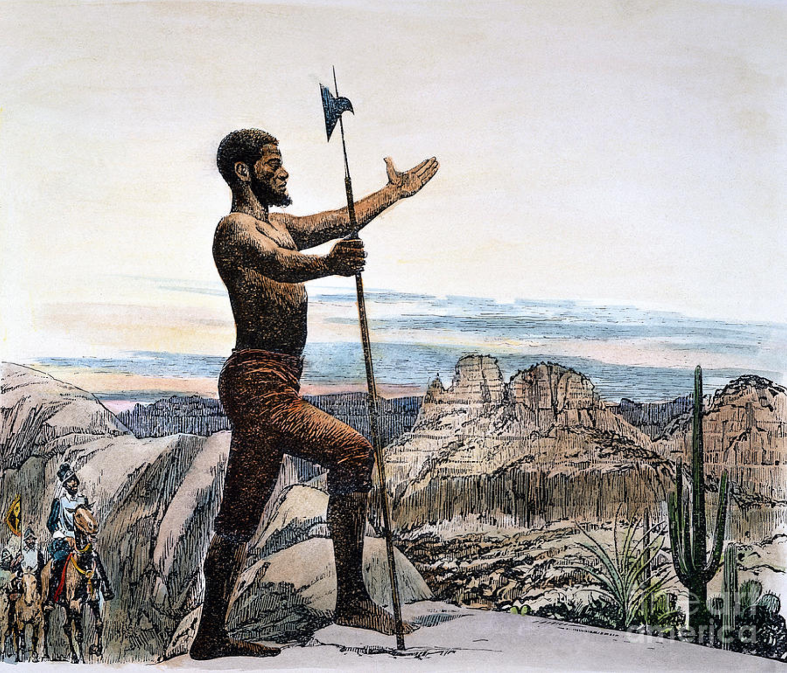

# Estevanico

The world's history is written by the victors and the victors are almost all exclusively European colonialists. I prefer to take "the road less taken" and spotlight those we so rarely get exposure to and Estevanico is one of these exemplary figures of history.

> **Estevanico** (c. 1500–1539), also known as Esteban de Dorantes and Estevanico the Moor, was the first person of African descent to explore North America. Little is known about his background but contemporary accounts described him as a "negro alárabe" or "Arabic-speaking black man" native to Azemmour, Morocco. In 1522, he was sold as a slave to the Spanish nobleman Andrés Dorantes de Carranza in the Portuguese-controlled Moroccan town of Azemmour. - [Wikipedia](https://en.wikipedia.org/wiki/Estevanico)

Estevanico participated in the Narváez expedition, which set out from Cuba under the leadership of Pánfilo de Narváez to explore and colonize Spanish Florida. This person is an explorer and this organization is about exploration. Therefore I am naming it after his legacy.

## Repos
My personal Github Organization dedicated to Explorations & Learning. 

The repositories contained herein are singularly focused on learning new concepts, technologies or exploring concepts. No repo in here is meant for production but rather exploring new ideas that I may blog or implement elsewhere if I find it fruitful or interesting enough to share.

Please, feel free to peruse and see what you can take from it as that would be a great compliment. No repo in here will be maintained with any ferocity nor consistency.

## References
- [Estevanico - Wikipedia](https://en.wikipedia.org/wiki/Estevanico)
- [Exploring Estevanico - Tampa Magazine](https://tampamagazines.com/exploring-estevanico/)
- [Estevanico, the great black explorer of North America \~ Africanity](https://www.africanidad.com/2016/05/estevanico-el-gran-explorador-negro-de_86.html)
